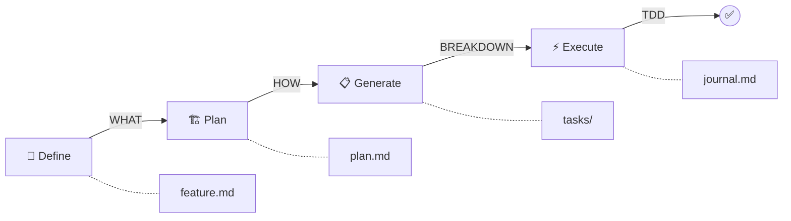

# Claude Task System - Structured Development Lifecycle Plugin

**Reference**: `references/claude-task-system/`
**Source**: https://github.com/Roeia1/claude-task-system
**Author**: [@Roeia1](https://github.com/Roeia1)
**Version**: 1.4.1
**Type**: Claude Code Plugin (12 skills, 3 agents)

## Overview

Claude Task System is a **complete development lifecycle plugin** that transforms feature ideas into shipped code through structured planning, test-driven development, and documented decisions. It provides a disciplined workflow from ideation through execution with human review gates at every phase.

**Core Philosophy**: "Stop the chaos. Ship with discipline."

## Why Claude Task System for Agentic Workflows?

This system demonstrates advanced patterns for:
1. **Structured Agent Workflows** - Multi-phase development lifecycle with gates
2. **Autonomous Task Execution** - Worker agents executing tasks in parallel
3. **Test-Driven Agents** - Enforced TDD with locked tests
4. **Continuous Documentation** - Automatic journaling of decisions and progress
5. **Git Worktree Parallelism** - Multiple isolated work environments
6. **Dynamic State Management** - Status derived from filesystem and git state
7. **Blocker Resolution** - Systematic approach to handling agent blockers

---

## Three-Phase Development Lifecycle



| Phase | Focus | Output | Human Gate |
|-------|-------|--------|-----------|
| **Feature Definition** | WHAT to build | `feature.md` | Requirements review |
| **Technical Planning** | HOW to build | `plan.md` | Architecture approval |
| **Task Generation** | BREAKDOWN work | Multiple `task.md` files | Task breakdown approval |
| **Task Execution** | DO the work | Code + tests + docs | PR review |

---

## Phase 1: Feature Definition

### Purpose
Transform natural language ideas into clear, structured requirements.

### Command
```bash
> define feature user authentication with OAuth
```

### What Claude Does
1. **Generates User Stories**:
   ```markdown
   As a user, I want to log in with Google
   As a developer, I want to securely manage OAuth tokens
   ```

2. **Identifies Acceptance Criteria**:
   ```markdown
   - User can authenticate with Google OAuth 2.0
   - JWT tokens expire after 24 hours
   - Failed login attempts are logged
   ```

3. **Captures Requirements**:
   - **Functional**: What the feature must do
   - **Non-Functional**: Performance, security, scalability constraints

4. **Flags Ambiguities**:
   ```markdown
   [NEEDS CLARIFICATION: Which OAuth providers should be supported?]
   [NEEDS CLARIFICATION: What is the token refresh strategy?]
   ```

5. **Iterates Until Clear**:
   - Asks clarifying questions
   - Updates feature.md based on feedback
   - Requests explicit approval before proceeding

### Output
**File**: `task-system/features/001-oauth-auth/feature.md`

```markdown
# Feature: OAuth Authentication

## User Stories
- As a user, I want to...

## Acceptance Criteria
- [ ] Criterion 1
- [ ] Criterion 2

## Functional Requirements
1. Requirement 1
2. Requirement 2

## Non-Functional Requirements
- Performance: < 200ms response time
- Security: OWASP Top 10 compliance

## Ambiguities
[NEEDS CLARIFICATION: ...]
```

---

## Phase 2: Technical Planning

### Purpose
Design the implementation architecture and strategy.

### Command
```bash
> plan feature
```

### 7-Phase Planning Process

#### 1. High-Level Architecture & Components
- System component diagram
- Component responsibilities
- Communication patterns

#### 2. Technology Selection
- Framework/library choices
- Infrastructure decisions
- **Creates ADRs for major decisions**

**Example ADR**:
```markdown
# ADR 001: WebSocket vs Server-Sent Events

## Context
Need real-time notifications for order updates

## Decision
Use WebSockets (Socket.IO library)

## Rationale
- Bidirectional communication needed
- Better browser support than SSE
- Socket.IO handles fallbacks automatically

## Consequences
+ Full duplex communication
+ Established patterns
- More complex than SSE
- Requires load balancer sticky sessions
```

#### 3. Data Modeling
- Database schema
- Entity relationships
- Migration strategy

#### 4. API Design
- Endpoint definitions
- Request/response schemas
- Authentication flow

#### 5. Implementation Strategy
- Development phases
- Dependencies between components
- Integration points

#### 6. Testing Strategy
- Unit test approach
- Integration test scenarios
- E2E test coverage

#### 7. Risk Assessment
- Technical risks and mitigation
- Dependencies and unknowns
- Complexity estimates

### Output
**File**: `task-system/features/001-oauth-auth/plan.md`
**ADRs**: `task-system/features/001-oauth-auth/adr/*.md`

---

## Phase 3: Task Generation

### Purpose
Break down the plan into executable, parallelizable tasks.

### Command
```bash
> generate tasks
```

### What Claude Does

1. **Proposes Task Breakdown**:
   ```
   Task 001: Set up OAuth library and configuration
   Task 002: Implement Google OAuth flow
   Task 003: JWT token generation and validation
   Task 004: Implement token refresh mechanism
   Task 005: Add security headers and CORS
   ```

2. **Awaits Approval**: Human reviews and approves task list

3. **For Each Approved Task**:
   - Creates git branch: `feature/001-oauth-auth/task-001`
   - Creates git worktree: `task-system/tasks/001/`
   - Generates comprehensive `task.md` file
   - Opens draft PR on GitHub
   - Links task back to feature

### Task Structure

**File**: `task-system/tasks/001/task-system/task-001/task.md`

```markdown
# Task 001: Set up OAuth library and configuration

## Objectives
1. Install passport-google-oauth20 library
2. Configure OAuth credentials
3. Set up callback URL routing
4. Create user session management

## Dependencies
- Environment variables: GOOGLE_CLIENT_ID, GOOGLE_CLIENT_SECRET
- Database: users table with oauth_provider field

## Test Requirements
- Test OAuth config initialization
- Test callback URL routing
- Test session creation

## Definition of Done
- [ ] All tests passing
- [ ] OAuth flow can be initiated
- [ ] User session created on callback
- [ ] Code committed and pushed
```

### Git Worktree Parallelism

Each task gets its own complete project checkout:

```
task-system/tasks/
├── 001/    # Full project for task 001
│   ├── src/
│   ├── tests/
│   └── task-system/
│       └── task-001/
│           ├── task.md
│           └── journal.md
├── 002/    # Full project for task 002
└── 003/    # Full project for task 003
```

**Benefits**:
- Work on multiple tasks simultaneously
- Isolated test environments
- Independent commit histories
- No context switching

---

## Phase 4: Task Execution

### Purpose
Autonomously implement tasks with test-driven development.

### Command
```bash
> /implement 001
```

### Execution Flow

#### 1. Orchestrator Spawns Worker
- Reads `task.md` for objectives
- Creates worker Claude instance
- Worker operates in task worktree

#### 2. Test-Driven Development (Enforced)

**Phase 1: Write Tests**
```javascript
describe('OAuth Authentication', () => {
  it('should redirect to Google OAuth', async () => {
    const res = await request(app).get('/auth/google');
    expect(res.status).toBe(302);
    expect(res.headers.location).toContain('accounts.google.com');
  });

  it('should create user on successful callback', async () => {
    // Test implementation
  });
});
```

**Test Lock**: After tests are written and committed, they can **only be modified with explicit user approval**. This enforces TDD discipline.

**Phase 2: Implement Code**
```javascript
router.get('/auth/google',
  passport.authenticate('google', { scope: ['profile', 'email'] })
);

router.get('/auth/google/callback',
  passport.authenticate('google', { failureRedirect: '/login' }),
  (req, res) => {
    // Create user session
    res.redirect('/dashboard');
  }
);
```

**Phase 3: Verify Tests Pass**
```bash
✓ should redirect to Google OAuth (45ms)
✓ should create user on successful callback (123ms)
```

#### 3. Continuous Journaling

Worker documents everything in `journal.md`:

```markdown
# Task 001 Execution Journal

## 2025-01-15 14:30 - Tests Created
Created 5 test cases for OAuth flow:
- OAuth redirect test
- Callback handling test
- User creation test
- Session management test
- Error handling test

Tests locked and committed: abc123

## 2025-01-15 14:45 - Implementation Started
Installing passport-google-oauth20...
Configuring OAuth strategy with Google credentials...

## 2025-01-15 15:00 - Decision: Session Storage
DECISION: Using Redis for session storage
RATIONALE: Better scalability than memory store
CONSEQUENCE: Need to add Redis dependency

## 2025-01-15 15:30 - Tests Passing
All 5 test cases passing ✓
Coverage: 95% (missing error edge case)

## 2025-01-15 15:45 - BLOCKER
BLOCKER: GOOGLE_CLIENT_SECRET not configured in environment
NEED: User to provide OAuth credentials
STATUS: BLOCKED
```

#### 4. Worker Exit Conditions

**FINISH**: All objectives complete
```markdown
## FINISH
All objectives completed:
✓ OAuth library configured
✓ Google OAuth flow implemented
✓ Tests passing (100% coverage)
✓ Code committed and pushed

PR: https://github.com/user/repo/pull/42
```

**BLOCKED**: Needs human decision
```markdown
## BLOCKED
Unable to proceed without OAuth credentials
Documented in journal.md
Use /resolve to provide resolution
```

**TIMEOUT**: Max execution time exceeded
```markdown
## TIMEOUT
Reached 2-hour execution limit
Progress saved and committed
Resume with: /implement 001
```

### Commit Discipline

Workers commit at phase boundaries:

```bash
git commit -m "test(task-001): add OAuth flow test suite"
git push origin feature/001-oauth-auth/task-001

git commit -m "feat(task-001): implement Google OAuth authentication"
git push origin feature/001-oauth-auth/task-001

git commit -m "docs(task-001): verification complete"
git push origin feature/001-oauth-auth/task-001
```

---

## Blocker Resolution System

### When Worker is Blocked

```bash
> /resolve
```

### Resolution Process

1. **Analyze Blocker from Journal**:
   ```
   Blocker identified: Missing OAuth credentials
   Task: 001
   Context: Implementing Google OAuth flow
   ```

2. **Propose Solutions**:
   ```
   Option 1: Use development OAuth credentials (test mode)
   Option 2: Halt until production credentials available
   Option 3: Mock OAuth for testing, add TODO for credentials
   ```

3. **Await User Decision**:
   ```
   User chooses: Option 3 - Mock for testing
   ```

4. **Update Journal**:
   ```markdown
   ## RESOLUTION
   BLOCKER: Missing OAuth credentials
   RESOLUTION: Mock OAuth flow for testing
   DECISION: Add environment variable TODO
   APPROVED BY: User
   ```

5. **Resume Execution**:
   ```bash
   > /implement 001
   # Worker continues with mock approach
   ```

---

## Dynamic State Management

### State Derivation

Status is **never manually updated**. It's derived from filesystem and git state:

```bash
> list tasks
```

**Output**:
```
┌────────┬───────────────────┬──────────────┬────────────┐
│ Task   │ Description       │ Status       │ PR         │
├────────┼───────────────────┼──────────────┼────────────┤
│ 001    │ OAuth setup       │ IN_PROGRESS  │ Draft #42  │
│ 002    │ Google flow       │ PENDING      │ -          │
│ 003    │ JWT tokens        │ REMOTE       │ Open #43   │
│ 004    │ Token refresh     │ COMPLETED    │ Merged #44 │
└────────┴───────────────────┴──────────────┴────────────┘
```

### Status Logic

| Status | Filesystem Signals |
|--------|-------------------|
| **PENDING** | Worktree exists, no `journal.md` created |
| **IN_PROGRESS** | Worktree exists, `journal.md` present |
| **REMOTE** | Open PR on GitHub, no local worktree |
| **COMPLETED** | PR merged, files moved to `archive/` |

**Implementation**:
```javascript
function deriveStatus(taskId) {
  const worktreeExists = fs.existsSync(`tasks/${taskId}`);
  const journalExists = fs.existsSync(`tasks/${taskId}/.../journal.md`);
  const pr = await gh.pr.list({ branch: `task-${taskId}` });

  if (pr.merged) return 'COMPLETED';
  if (pr.open && !worktreeExists) return 'REMOTE';
  if (journalExists) return 'IN_PROGRESS';
  if (worktreeExists) return 'PENDING';
}
```

---

## Resume Work Anywhere

### Remote Collaboration Pattern

**Developer A** (Machine 1):
```bash
> /implement 001
# Works on task, pushes to PR
```

**Developer B** (Machine 2):
```bash
> resume task 001
# Creates local worktree from remote branch
# Reads journal.md to understand progress
# Continues work where Developer A left off
```

### Resume Process

1. **Fetch Remote Branch**: `git fetch origin feature/001-oauth-auth/task-001`
2. **Create Local Worktree**: `git worktree add tasks/001`
3. **Load Context**: Read `journal.md` for execution history
4. **Continue Execution**: `/implement 001` picks up where it left off

---

## Architecture Decision Records (ADRs)

### Creating ADRs

```bash
> create ADR for PostgreSQL vs MongoDB
```

### ADR Template

```markdown
# ADR 003: PostgreSQL vs MongoDB for User Storage

## Status
Accepted

## Context
Need to choose database for user authentication data:
- OAuth tokens
- User profiles
- Session management

## Options Considered

### Option 1: PostgreSQL
**Pros**:
- Strong ACID guarantees
- Excellent for relational user data
- Mature JSON support for flexible fields

**Cons**:
- Requires schema migrations
- Less flexible for rapid iteration

### Option 2: MongoDB
**Pros**:
- Schema flexibility
- Easy to iterate on data model
- Good JSON support

**Cons**:
- Weaker consistency guarantees
- Additional operational complexity

## Decision
Use PostgreSQL

## Rationale
1. Authentication data requires strong consistency
2. User relationships (profiles, sessions, tokens) are relational
3. Team has PostgreSQL expertise
4. JSON fields provide flexibility where needed

## Consequences

### Positive
+ Data integrity guaranteed
+ Easier to query relationships
+ Better tooling support

### Negative
- Schema migrations required for changes
- Slightly more setup complexity

## Links
- Feature: 001-oauth-auth
- Task: 002 (database setup)
```

### ADR Locations

- **Feature-specific**: `task-system/features/001-auth/adr/`
- **Global**: `task-system/adrs/`

---

## Non-Negotiable Rules

These rules are **enforced by the system**, not just guidelines:

### 1. Test-Driven Development
- **Tests before implementation, always**
- Tests are **locked** after creation
- Modifications require explicit user approval

### 2. Phase Gates
- **Explicit permission required** to proceed between phases
- No automatic progression
- Human review at each gate

### 3. No Test Tampering
- After `git commit -m "test(...)"`, tests are immutable
- Prevents gaming the system
- Maintains TDD discipline

### 4. Continuous Journaling
- **Every decision documented** in `journal.md`
- Technical choices explained
- Blockers and resolutions recorded

### 5. Commit Discipline
- **Commit and push at phase boundaries**
- Phase-based commit messages
- Enables distributed collaboration

### 6. Sequential Phases
- **No skipping phases**
- No shortcuts
- Each phase builds on previous

---

## Plugin Architecture

### Structure

```
plugin/
├── .claude-plugin/
│   └── plugin.json           # Plugin manifest
├── agents/
│   ├── task-orchestrator.md  # Spawns workers
│   ├── task-worker.md         # Executes tasks
│   └── task-builder.md        # Creates tasks in parallel
├── commands/                  # Slash commands
│   ├── init.md                # /task-system:init
│   ├── implement.md           # /implement
│   ├── resolve.md             # /resolve
│   └── task-list.md           # /task-system:task-list
├── instructions/              # Centralized content
│   ├── implement/
│   │   └── INSTRUCTIONS.md
│   ├── resolve/
│   │   └── INSTRUCTIONS.md
│   ├── feature-definition/
│   │   ├── INSTRUCTIONS.md
│   │   └── templates/
│   │       └── feature.md
│   └── feature-planning/
│       ├── INSTRUCTIONS.md
│       └── templates/
│           └── plan.md
├── skills/                    # Natural language activation
│   ├── feature-definition/
│   │   └── SKILL.md
│   ├── feature-planning/
│   │   └── SKILL.md
│   ├── task-generation/
│   │   └── SKILL.md
│   └── architecture-decisions/
│       └── SKILL.md
└── hooks/
    └── session-init.sh        # Session startup
```

### Design Patterns

**1. Instruction Centralization**:
- Commands and skills **reference** centralized instructions
- DRY principle: single source of truth
- Easier maintenance and updates

**2. Agent Specialization**:
- **Orchestrator**: Manages task lifecycle
- **Worker**: Executes single task autonomously
- **Builder**: Creates tasks in parallel

**3. Template-Based Generation**:
- `feature.md` template
- `plan.md` template
- `task.md` template
- ADR template

**4. Hook System**:
- Session initialization
- Pre-commit validation
- Post-merge cleanup

---

## Directory Structure

```
your-project/
├── src/                        # Your application code
├── tests/                      # Your tests
└── task-system/                # Plugin directory (gitignored/tracked mix)
    ├── features/               # TRACKED - Feature definitions
    │   └── 001-oauth-auth/
    │       ├── feature.md      # Requirements
    │       ├── plan.md         # Architecture
    │       ├── tasks.md        # Task reference
    │       └── adr/            # ADRs
    │           └── 001-postgres.md
    ├── tasks/                  # GITIGNORED - Active worktrees
    │   ├── 001/                # Full project checkout
    │   │   ├── src/
    │   │   ├── tests/
    │   │   └── task-system/
    │   │       └── task-001/
    │   │           ├── task.md
    │   │           └── journal.md
    │   └── 002/
    ├── archive/                # TRACKED - Completed tasks
    │   └── task-001/
    │       ├── task.md
    │       └── journal.md
    └── adrs/                   # TRACKED - Global ADRs
        └── 001-global-decision.md
```

### Git Strategy

**.gitignore**:
```
task-system/tasks/  # Don't track active worktrees
```

**Tracked**:
- `features/` - Requirements and plans
- `archive/` - Completed task records
- `adrs/` - Decision records

**Not Tracked**:
- `tasks/` - Active worktrees (too large, in flux)

---

## Commands & Skills Reference

### Commands (Slash Commands)

| Command | Description | Example |
|---------|-------------|---------|
| `/task-system:init` | Initialize directory structure | `/task-system:init` |
| `/task-system:feature-definition [desc]` | Create feature document | `/task-system:feature-definition user auth` |
| `/task-system:feature-planning [id]` | Create technical plan | `/task-system:feature-planning 001` |
| `/task-system:task-generation [id]` | Generate tasks | `/task-system:task-generation 001` |
| `/task-system:task-list` | Show all tasks with status | `/task-system:task-list` |
| `/implement [task-id]` | Execute task autonomously | `/implement 001` |
| `/resolve` | Analyze and resolve blockers | `/resolve` |
| `/task-system:task-cleanup [id]` | Remove worktree after merge | `/task-system:task-cleanup 001` |
| `/task-system:task-resume [id]` | Continue remote task locally | `/task-system:task-resume 017` |
| `/task-system:architecture-decisions [topic]` | Create ADR | `/task-system:architecture-decisions database` |

### Skills (Natural Language)

| Skill | Activation Phrase | Description |
|-------|------------------|-------------|
| Feature Definition | "define feature [description]" | Create requirements document |
| Feature Planning | "plan feature" | Design technical implementation |
| Task Generation | "generate tasks" | Break feature into tasks |
| Task List | "list tasks" / "show tasks" | Display task status |
| Task Cleanup | "cleanup task [id]" | Remove completed worktree |
| Task Resume | "resume task [id]" | Continue remote task |
| Architecture Decisions | "create ADR for [topic]" | Document architectural decision |

---

## Integration with Agentic Workflows

### Use Case 1: Multi-Agent Development Team

**Pattern**: Multiple agents working on parallel tasks

```bash
# Orchestrator creates tasks
> generate tasks
# Creates: task-001, task-002, task-003

# Spawn 3 worker agents in parallel
> /implement 001  # Worker Agent 1
> /implement 002  # Worker Agent 2
> /implement 003  # Worker Agent 3

# Each worker:
# - Operates in isolated worktree
# - Writes tests first
# - Implements code
# - Documents in journal.md
# - Commits and pushes
# - Opens PR
```

**Result**: 3 PRs ready for review simultaneously

### Use Case 2: Test-Driven Agent Development

**Pattern**: Enforced TDD for agent code generation

```bash
> /implement 001

# Agent writes tests first
test(task-001): add API endpoint tests
# Tests committed and LOCKED

# Agent implements code to pass tests
feat(task-001): implement /auth/google endpoint

# Agent verifies tests pass
✓ All tests passing

# Agent cannot modify tests without approval
# Ensures TDD discipline
```

**Result**: High-quality, test-covered code

### Use Case 3: Distributed Agent Collaboration

**Pattern**: Hand-off between agents/developers

```bash
# Day 1 - Agent A starts task
Developer A> /implement 001
# Agent A makes progress, commits, pushes

# Day 2 - Agent B continues task
Developer B> resume task 001
# Creates worktree from remote
# Reads journal.md for context
# Continues where Agent A left off
```

**Result**: Seamless collaboration across time/space

### Use Case 4: Decision Documentation for Agents

**Pattern**: Capture agent reasoning for future reference

```markdown
## journal.md Entry

## 2025-01-15 14:30 - DECISION: Rate Limiting Strategy
CONTEXT: API endpoint needs rate limiting
OPTIONS CONSIDERED:
1. In-memory (simple but doesn't scale)
2. Redis (scalable but adds dependency)
3. None (risky for abuse)

DECISION: Redis-based rate limiting
RATIONALE:
- Scalability is priority
- Redis already in stack
- Proven pattern

CONSEQUENCES:
+ Scales horizontally
+ Shared rate limits
- Additional Redis dependency
- Slightly more complex deployment
```

**Result**: Future agents can understand past decisions

---

## Key Patterns to Apply

### 1. Phase Gate Pattern

**Apply to**: Any multi-step agent workflow

**Pattern**:
```markdown
Phase 1: Research → GATE (human approval)
Phase 2: Design → GATE (human approval)
Phase 3: Implement → GATE (human approval)
Phase 4: Verify → GATE (human approval)
```

**Benefits**:
- Human oversight at critical points
- Prevents runaway automation
- Validates each phase before proceeding

### 2. Test-Locked TDD

**Apply to**: Code generation agents

**Pattern**:
```markdown
1. Agent writes tests
2. Commit tests with special marker
3. LOCK tests (require approval to modify)
4. Agent implements code to pass tests
5. Verify tests pass
6. Cannot proceed if tests fail
```

**Benefits**:
- Enforces test-first discipline
- Prevents test tampering
- Ensures quality standards

### 3. Continuous Journaling

**Apply to**: Long-running agent tasks

**Pattern**:
```markdown
## journal.md Structure

## [Timestamp] - [Phase]
ACTION: What was done
DECISION: Why it was done
OUTCOME: What resulted
NEXT: What comes next
```

**Benefits**:
- Complete execution audit trail
- Context for resuming work
- Learning from agent decisions

### 4. Dynamic State Derivation

**Apply to**: Agent task management

**Pattern**:
```javascript
// Never store status explicitly
// Derive from observable signals

function deriveAgentStatus(agentId) {
  const hasLogs = fs.existsSync(`logs/${agentId}.log`);
  const isRunning = processExists(agentId);
  const hasOutput = fs.existsSync(`output/${agentId}/`);

  if (hasOutput && !isRunning) return 'COMPLETED';
  if (hasLogs && isRunning) return 'IN_PROGRESS';
  if (!isRunning) return 'PENDING';
}
```

**Benefits**:
- No manual status updates
- Source of truth is filesystem/process state
- Impossible to have stale status

### 5. Blocker Resolution Protocol

**Apply to**: Handling agent uncertainty

**Pattern**:
```markdown
1. Agent encounters blocker
2. Agent documents in journal:
   - BLOCKER: Description
   - CONTEXT: Surrounding situation
   - OPTIONS: Possible resolutions
3. Agent exits with BLOCKED status
4. Human analyzes blocker
5. Human provides resolution
6. Agent resumes with resolution applied
```

**Benefits**:
- Systematic handling of agent limits
- Human-in-the-loop for ambiguity
- Documented resolution for future reference

---

## Installation

### Prerequisites
- [Claude Code CLI](https://github.com/anthropics/claude-code) installed
- Git repository initialized
- GitHub CLI (`gh`) for PR operations

### Installation Methods

**Option 1: From GitHub (Latest)**
```bash
/plugin marketplace add Roeia1/claude-task-system
/plugin install claude-task-system@claude-task-system
```

**Option 2: Specific Version**
```bash
/plugin install claude-task-system@claude-task-system@1.4.1
```

**Option 3: Interactive**
```bash
/plugin
# Select "Browse Plugins" → find claude-task-system → install
```

### Initialize Project

```bash
cd your-project
claude
> /task-system:init
```

Creates directory structure:
```
task-system/
├── features/
├── tasks/
├── archive/
└── adrs/
```

---

## Complete Workflow Example

### Session 1: Define and Plan

```bash
# 1. Define feature
> define feature shopping cart with guest checkout

Claude: I'll create a feature definition. Here's what I understand:
- Guest users can add items to cart
- Guest users can complete checkout
- Cart persists in session/localStorage
- [NEEDS CLARIFICATION: Should guest carts convert to user carts on registration?]

You: Yes, convert to user cart on registration

Claude: Updated feature.md with clarification.
Ready to proceed to planning? (yes/no)

You: yes

# 2. Create technical plan
> plan feature

Claude: Creating technical plan with 7 phases...
[Generates plan.md with architecture, tech choices, data models, APIs, etc.]

Major decisions requiring ADRs:
- LocalStorage vs SessionStorage for guest cart
- Guest cart migration strategy

Create ADRs now? (yes/no)

You: yes

Claude: Created ADR 001: LocalStorage for Guest Cart
Ready to proceed to task generation? (yes/no)

You: yes

# 3. Generate tasks
> generate tasks

Claude: Proposed tasks for shopping cart feature:
001: Set up cart data models and migrations
002: Implement cart item CRUD operations
003: Build guest cart localStorage layer
004: Create checkout API endpoints
005: Implement guest-to-user cart migration
006: Add cart UI components

Approve task breakdown? (yes/no)

You: yes

Claude: Creating tasks...
✓ Task 001 created (branch: feature/001-cart/task-001, PR: #42)
✓ Task 002 created (branch: feature/001-cart/task-002, PR: #43)
...
All tasks ready for implementation.
```

### Session 2: Execute Tasks

```bash
# 4. Implement first task
> /implement 001

Claude: Starting autonomous execution of task 001...
Worker spawned, reading task.md...

[Worker executes TDD workflow]
✓ Tests written and committed (locked)
✓ Implementation complete
✓ All tests passing (100% coverage)
✓ Code committed and pushed
✓ PR updated

Task 001: FINISH
All objectives completed.
PR ready for review: #42

# 5. Handle blocker in task 002
> /implement 002

[Worker encounters blocker]
Worker: BLOCKED
Unable to determine cart migration strategy for anonymous users
Documented in journal.md

> /resolve

Claude: Analyzing blocker from task 002 journal...

BLOCKER: Cart migration strategy unclear
CONTEXT: Guest adds items, then registers
QUESTION: Merge with existing user cart or replace?

OPTIONS:
1. Merge carts (combine items)
2. Replace user cart with guest cart
3. Ask user which to keep

Recommendation: Option 1 (Merge carts)
Rationale: Best user experience, no data loss

Approve resolution? (yes/no)

You: yes

Claude: Resolution documented in journal.
Resuming task 002...

> /implement 002

[Worker continues with merge strategy]
✓ Task 002: FINISH

# 6. Continue with remaining tasks
> /implement 003
> /implement 004
> /implement 005
> /implement 006

# All tasks complete, PRs ready for review
```

---

## Key Takeaways

1. **Structured Workflow** - Three-phase development lifecycle with human gates
2. **Enforced TDD** - Tests locked after creation, no tampering
3. **Autonomous Execution** - Worker agents complete tasks independently
4. **Continuous Documentation** - Every decision captured in journal.md
5. **Parallel Work** - Git worktrees enable multiple simultaneous tasks
6. **Dynamic State** - Status derived from filesystem, never stale
7. **Blocker Resolution** - Systematic approach to handling agent limits
8. **ADR Integration** - Architecture decisions documented and linked
9. **Distributed Collaboration** - Resume work from any machine
10. **Plugin Architecture** - Centralized instructions, specialized agents

---

## Resources

- **Repository**: `references/claude-task-system/`
- **GitHub**: https://github.com/Roeia1/claude-task-system
- **Author**: [@Roeia1](https://github.com/Roeia1)
- **Changelog**: See CHANGELOG.md for version history
- **Issues**: https://github.com/Roeia1/claude-task-system/issues

---

**"Stop the chaos. Ship with discipline."** - Claude Task System demonstrates how to build structured, test-driven, documented agentic workflows with human oversight at every critical decision point.
