# Mermaid Diagram Syntax Reference

Complete syntax guide for generating diagrams with Mermaid.

## Supported Diagram Types

| Type | Use Case |
|------|----------|
| Flowchart | Process flows, decision trees, workflows |
| Sequence | API calls, system interactions, message flows |
| Class | OOP architecture, data models |
| State | State machines, lifecycle diagrams |
| Mindmap | Concept maps, brainstorming, hierarchies |
| Gantt | Project timelines, schedules |
| Pie | Data distribution |
| Git Graph | Branch visualization |
| ER Diagram | Database schemas |
| User Journey | Experience mapping |

---

## 1. Flowchart

### Direction
```mermaid
flowchart LR   %% Left to Right
flowchart TD   %% Top Down (default)
flowchart BT   %% Bottom to Top
flowchart RL   %% Right to Left
```

### Node Shapes
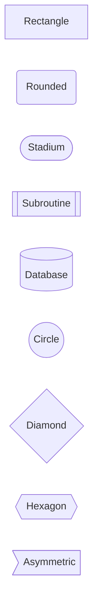

### Arrows/Links
```mermaid
flowchart LR
    A --> B           %% Arrow
    A --- B           %% Line
    A -.-> B          %% Dotted arrow
    A ==> B           %% Thick arrow
    A --o B           %% Circle end
    A --x B           %% Cross end
    A <--> B          %% Bidirectional
    A -->|label| B    %% With label
```

### Subgraphs
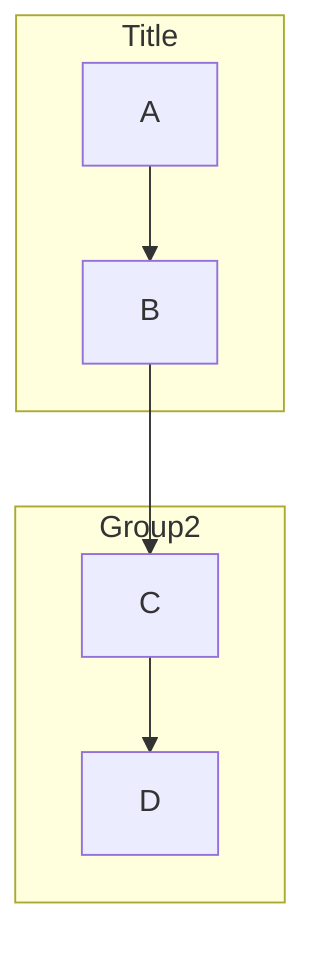

### Styling
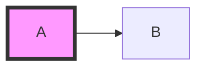

---

## 2. Sequence Diagram

### Basic
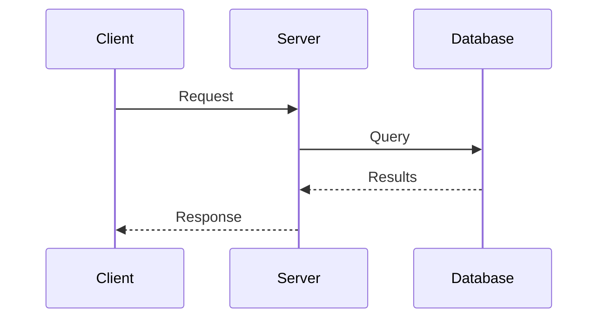

### Arrow Types
| Syntax | Description |
|--------|-------------|
| `->` | Solid line |
| `-->` | Dotted line |
| `->>` | Solid with arrow |
| `-->>` | Dotted with arrow |
| `-x` | Solid with cross |
| `--x` | Dotted with cross |
| `-)` | Async (open arrow) |

### Activations
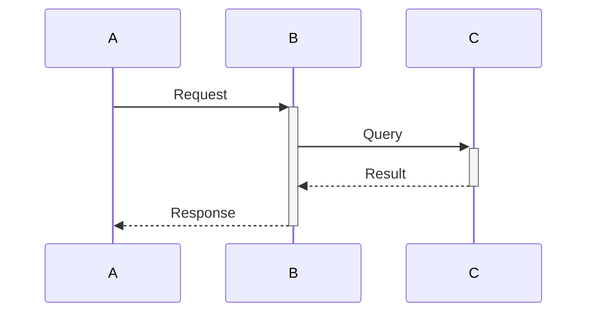

### Loops & Conditions
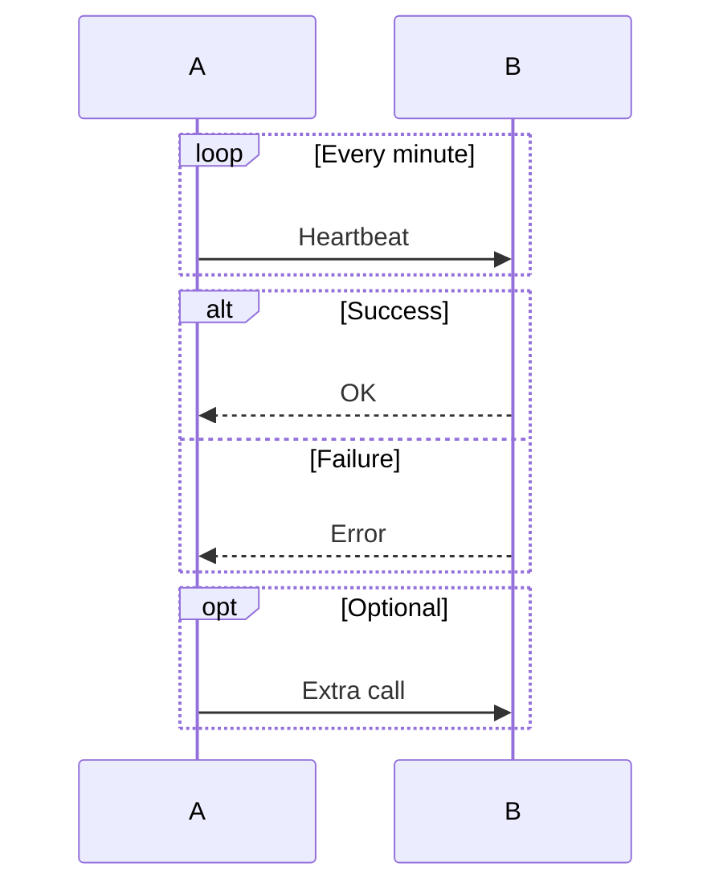

### Notes
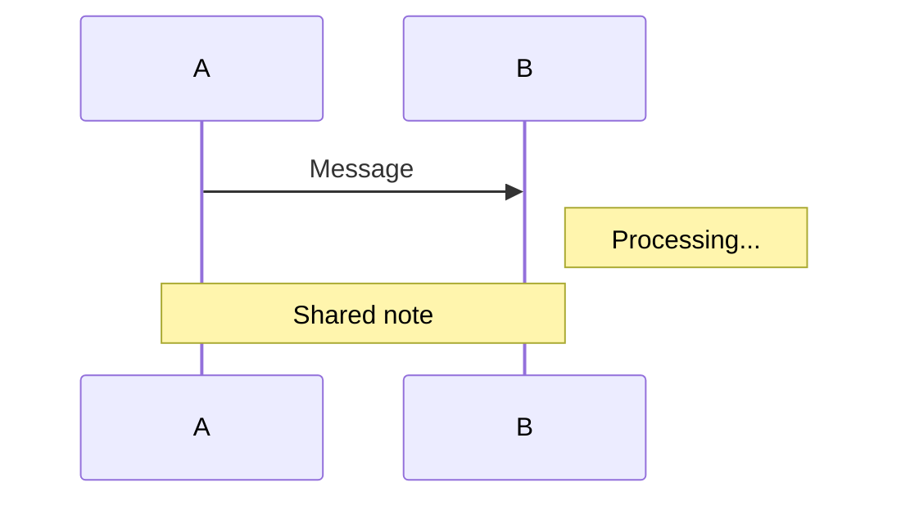

### Parallel
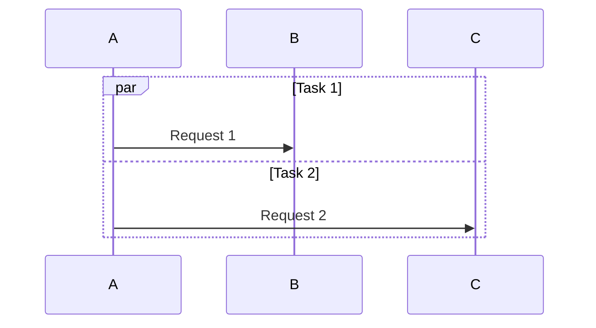

---

## 3. Class Diagram

### Classes & Members
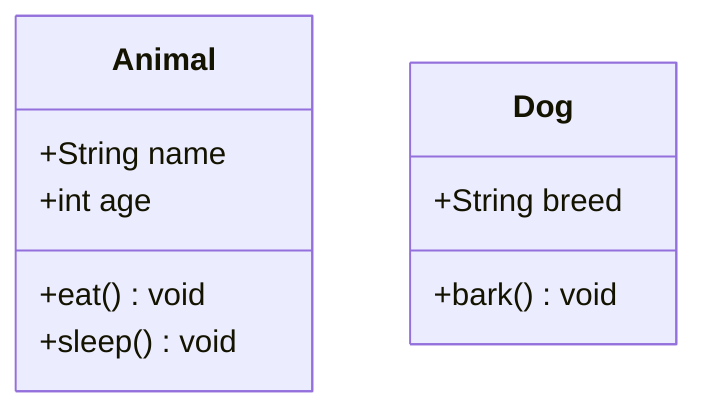

### Visibility
| Prefix | Meaning |
|--------|---------|
| `+` | Public |
| `-` | Private |
| `#` | Protected |
| `~` | Package |

### Relationships
```mermaid
classDiagram
    Animal <|-- Dog        %% Inheritance
    Car *-- Engine         %% Composition
    Library o-- Book       %% Aggregation
    Student --> Course     %% Association
    Class1 ..> Class2      %% Dependency
    Interface ..|> Class   %% Realization
```

### Cardinality
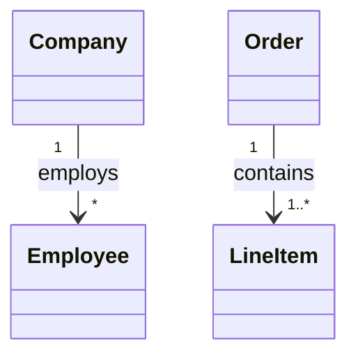

### Annotations
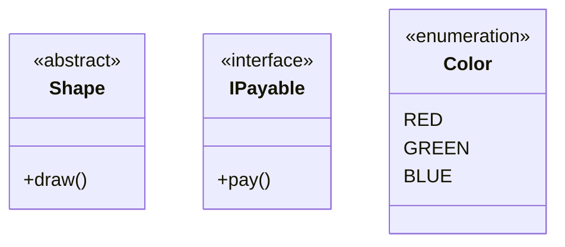

---

## 4. State Diagram

### Basic
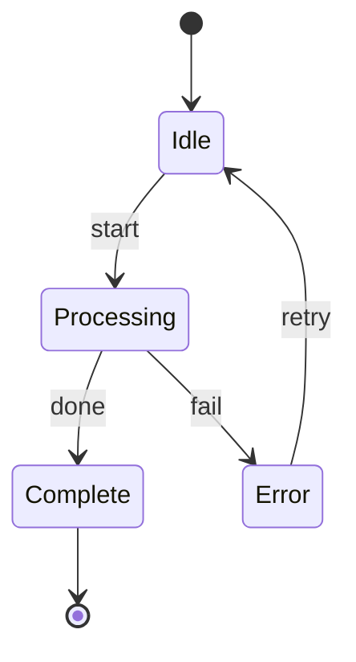

### Composite States
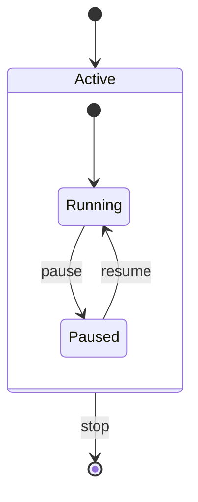

### Fork/Join
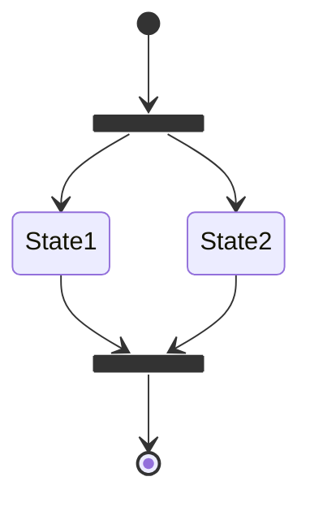

### Choice
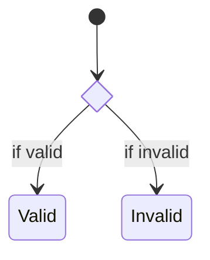

### Notes
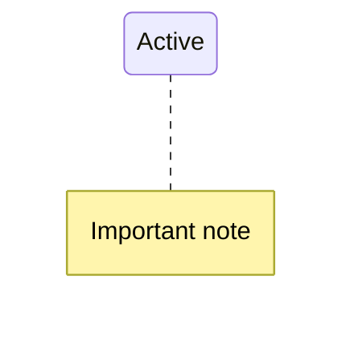

---

## 5. Mindmap

### Basic Structure (indentation-based)
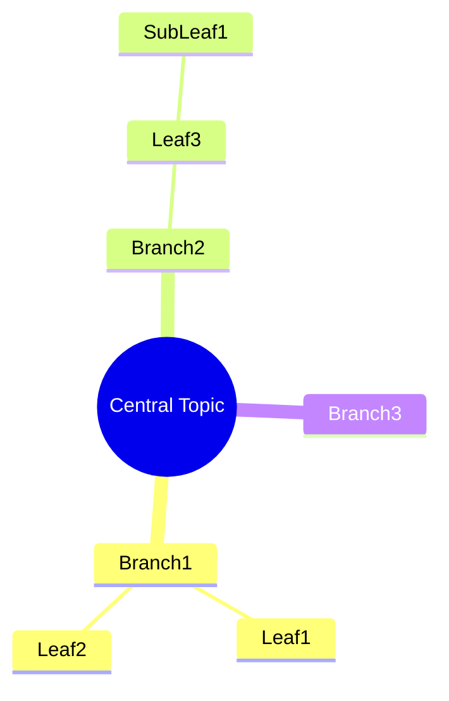

### Node Shapes
```mermaid
mindmap
    root[Square Root]
        (Rounded)
        ((Circle))
        ))Cloud((
        {{Hexagon}}
```

### Icons
```mermaid
mindmap
    root((Project))
        Planning::icon(fa fa-calendar)
        Development::icon(fa fa-code)
        Testing::icon(fa fa-bug)
```

---

## 6. Pie Chart

```mermaid
pie title Distribution
    "Category A" : 40
    "Category B" : 30
    "Category C" : 20
    "Category D" : 10
```

---

## 7. Gantt Chart

```mermaid
gantt
    title Project Timeline
    dateFormat YYYY-MM-DD

    section Phase 1
    Task 1           :a1, 2024-01-01, 30d
    Task 2           :after a1, 20d

    section Phase 2
    Task 3           :2024-02-15, 25d
    Milestone        :milestone, m1, 2024-03-15, 0d
```

---

## 8. ER Diagram

```mermaid
erDiagram
    CUSTOMER ||--o{ ORDER : places
    ORDER ||--|{ LINE_ITEM : contains
    PRODUCT ||--o{ LINE_ITEM : "ordered in"

    CUSTOMER {
        int id PK
        string name
        string email
    }
    ORDER {
        int id PK
        date created
        int customer_id FK
    }
```

---

## 9. Git Graph

```mermaid
gitGraph
    commit
    commit
    branch develop
    checkout develop
    commit
    commit
    checkout main
    merge develop
    commit
```

---

## Common Styling

### Theme Configuration
```mermaid
%%{init: {'theme': 'dark'}}%%
flowchart LR
    A --> B
```

Available themes: `default`, `dark`, `forest`, `neutral`, `base`

### Custom Colors
```mermaid
flowchart LR
    A --> B
    style A fill:#ff6b6b,stroke:#333,stroke-width:2px,color:#fff
    style B fill:#4ecdc4,stroke:#333,stroke-width:2px
```

### Class Definitions
```mermaid
flowchart LR
    A:::red --> B:::blue
    classDef red fill:#ff6b6b,stroke:#333
    classDef blue fill:#4ecdc4,stroke:#333
```

---

## Usage in Python

### Generate Mermaid Code
```python
def generate_flowchart(nodes, edges):
    """Generate Mermaid flowchart from nodes and edges"""
    lines = ["flowchart TD"]

    for node_id, label in nodes.items():
        lines.append(f"    {node_id}[{label}]")

    for source, target, label in edges:
        if label:
            lines.append(f"    {source} -->|{label}| {target}")
        else:
            lines.append(f"    {source} --> {target}")

    return "\n".join(lines)
```

### Render Options
1. **Mermaid Live Editor**: https://mermaid.live
2. **GitHub/GitLab**: Native rendering in markdown
3. **HTML**: Include mermaid.js library
4. **Python**: Use `mermaid-py` or save as `.mmd` file

---

## Agent Workflow Example

```mermaid
flowchart TD
    subgraph Input
        U[User Query]
    end

    subgraph Coordinator
        C{Analyze Complexity}
    end

    subgraph Agents
        R[Researcher]
        A[Analyst]
        W[Writer]
    end

    subgraph Output
        O[Final Report]
    end

    U --> C
    C -->|Simple| W
    C -->|Moderate| R --> W
    C -->|Complex| R --> A --> W
    W --> O

    style C fill:#4a90d9,stroke:#333
    style R fill:#50c878,stroke:#333
    style A fill:#da70d6,stroke:#333
    style W fill:#20b2aa,stroke:#333
```

---

## Multi-Agent System Example

```mermaid
sequenceDiagram
    participant U as User
    participant C as Coordinator
    participant R as Researcher
    participant A as Analyst
    participant W as Writer

    U->>C: Complex Query
    C->>C: Create Plan
    C->>R: Research Task

    activate R
    R->>R: Search arXiv
    R->>R: Search GitHub
    R->>R: Analyze PDFs
    R-->>C: Findings
    deactivate R

    C->>A: Analyze Findings
    activate A
    A->>A: Identify Patterns
    A->>A: Draw Conclusions
    A-->>C: Analysis
    deactivate A

    C->>W: Write Report
    activate W
    W->>W: Format Content
    W-->>C: Report
    deactivate W

    C-->>U: Final Response
```

---

## References

- Official Docs: https://mermaid.js.org
- Live Editor: https://mermaid.live
- GitHub Repo: https://github.com/mermaid-js/mermaid
