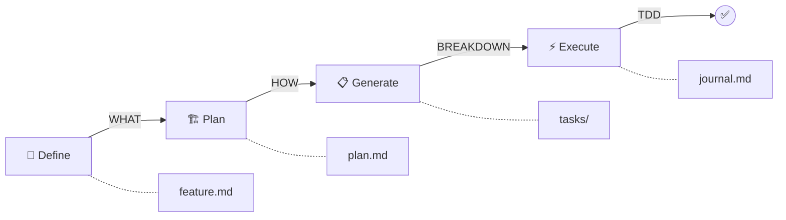

# Structured Development Lifecycle Pattern

## Overview

**Source**: Claude Task System - `references/claude-task-system/`

**Purpose**: Transform feature ideas into shipped code through a structured, multi-phase workflow with human oversight gates and enforced quality standards.

## Context

When to use this pattern:
- Building complex features requiring architectural planning
- Need to enforce test-driven development discipline
- Want complete audit trail of decisions and progress
- Managing distributed or asynchronous collaboration
- Require human approval before proceeding with implementation

## The Pattern

### Three-Phase Lifecycle



### Phase 1: Feature Definition (WHAT)

**Objective**: Transform natural language into structured requirements

**Process**:
1. User describes feature in natural language
2. Agent generates user stories and acceptance criteria
3. Agent identifies functional and non-functional requirements
4. Agent flags ambiguities with `[NEEDS CLARIFICATION: ...]`
5. Iterate until requirements are crystal clear
6. **GATE**: User approves before proceeding to planning

**Output**: `features/001-feature-name/feature.md`

**Template**:
```markdown
# Feature: [Name]

## User Stories
- As a [role], I want to [action] so that [benefit]

## Acceptance Criteria
- [ ] Criterion 1
- [ ] Criterion 2

## Functional Requirements
1. Requirement with specific behavior

## Non-Functional Requirements
- Performance: Response time targets
- Security: Compliance requirements
- Scalability: Load expectations

## Ambiguities
[NEEDS CLARIFICATION: Specific question requiring user input]
```

**Key Insight**: Don't proceed until ambiguities are resolved. Saves massive rework later.

---

### Phase 2: Technical Planning (HOW)

**Objective**: Design implementation architecture and strategy

**Process**:
1. High-level architecture & components
2. Technology selection (creates ADRs for major decisions)
3. Data modeling
4. API design
5. Implementation strategy
6. Testing strategy
7. Risk assessment
8. **GATE**: User approves architecture before task breakdown

**Output**: `features/001-feature-name/plan.md` + ADRs

**7-Phase Planning Structure**:

```markdown
# Technical Plan: [Feature Name]

## 1. Architecture & Components
- System component diagram
- Component responsibilities
- Communication patterns

## 2. Technology Selection
- Framework/library choices
- Infrastructure decisions
- **ADRs for major decisions**

## 3. Data Modeling
- Database schema
- Entity relationships
- Migration strategy

## 4. API Design
- Endpoint definitions
- Request/response schemas
- Authentication flow

## 5. Implementation Strategy
- Development phases
- Dependencies between components
- Integration points

## 6. Testing Strategy
- Unit test approach
- Integration test scenarios
- E2E test coverage

## 7. Risk Assessment
- Technical risks and mitigation
- Dependencies and unknowns
- Complexity estimates
```

**Key Insight**: Create ADRs during planning, not as afterthought. Captures reasoning while fresh.

---

### Phase 3: Task Generation (BREAKDOWN)

**Objective**: Break plan into executable, parallelizable tasks

**Process**:
1. Agent proposes task breakdown
2. **GATE**: User reviews and approves task list
3. For each approved task:
   - Create git branch: `feature/001-name/task-001`
   - Create git worktree: `tasks/001/`
   - Generate comprehensive `task.md`
   - Open draft PR on GitHub
   - Link task back to feature

**Output**: Multiple task worktrees

**Task Structure**:
```markdown
# Task 001: [Description]

## Objectives
1. Specific objective 1
2. Specific objective 2

## Dependencies
- Environment variables needed
- Database schema requirements
- External services

## Test Requirements
- Test scenarios to implement
- Coverage expectations

## Definition of Done
- [ ] All tests passing
- [ ] Code meets acceptance criteria
- [ ] Documentation updated
- [ ] Code committed and pushed
```

**Key Insight**: Git worktrees enable parallel work on multiple tasks without context switching.

---

### Phase 4: Task Execution (DO)

**Objective**: Autonomously implement with enforced TDD

**Process**:

#### Step 1: Test-Driven Development (Enforced)

```
Phase 1: Write Tests
├─ Create test suite for all objectives
├─ Commit tests: git commit -m "test(task-001): add test suite"
└─ LOCK TESTS (cannot modify without approval)

Phase 2: Implement Code
├─ Write code to pass tests
├─ Commit implementation: git commit -m "feat(task-001): implement feature"
└─ Tests remain locked

Phase 3: Verify
├─ Run test suite
├─ All tests must pass
└─ Commit verification: git commit -m "docs(task-001): verification complete"
```

**Test Lock Enforcement**:
- After test commit, tests can ONLY be modified with explicit user approval
- Prevents gaming the system by changing tests to match implementation
- Maintains TDD discipline

#### Step 2: Continuous Journaling

Document everything in `journal.md`:

```markdown
# Task 001 Execution Journal

## [Timestamp] - Tests Created
Created 5 test cases:
- Test case 1
- Test case 2

Tests locked: commit abc123

## [Timestamp] - Implementation Started
Installing dependencies...
Configuring components...

## [Timestamp] - DECISION: [Topic]
DECISION: Chose approach X over Y
RATIONALE: Reason for choice
CONSEQUENCE: Impact of this decision

## [Timestamp] - Tests Passing
All tests passing ✓
Coverage: 95%

## [Timestamp] - BLOCKER
BLOCKER: Issue encountered
CONTEXT: Surrounding situation
OPTIONS: Possible resolutions
STATUS: BLOCKED
```

#### Step 3: Worker Exit Conditions

**FINISH**: All objectives complete
```markdown
## FINISH
All objectives completed:
✓ Objective 1
✓ Objective 2
✓ Tests passing (100% coverage)
✓ Code committed and pushed
PR: https://github.com/user/repo/pull/42
```

**BLOCKED**: Needs human decision
```markdown
## BLOCKED
Unable to proceed: [reason]
Documented above with context and options
Use /resolve to provide resolution
```

**TIMEOUT**: Max execution time exceeded
```markdown
## TIMEOUT
Reached execution limit
Progress saved and committed
Resume with: /implement [task-id]
```

---

## Implementation

### Directory Structure

```
project/
├── src/                    # Application code
├── task-system/
│   ├── features/           # TRACKED
│   │   └── 001-feature/
│   │       ├── feature.md  # Requirements
│   │       ├── plan.md     # Architecture
│   │       ├── tasks.md    # Task reference
│   │       └── adr/        # Decision records
│   ├── tasks/              # GITIGNORED
│   │   └── 001/            # Full project worktree
│   │       └── task-system/
│   │           └── task-001/
│   │               ├── task.md
│   │               └── journal.md
│   └── archive/            # TRACKED
│       └── task-001/       # Completed tasks
│           ├── task.md
│           └── journal.md
```

### State Management (Dynamic Derivation)

**Never manually update status**. Derive from observable signals:

```javascript
function deriveTaskStatus(taskId) {
  const worktreeExists = fs.existsSync(`tasks/${taskId}`);
  const journalExists = fs.existsSync(`tasks/${taskId}/.../journal.md`);
  const pr = await gh.pr.list({ branch: `task-${taskId}` });

  if (pr.merged) return 'COMPLETED';
  if (pr.open && !worktreeExists) return 'REMOTE';
  if (journalExists) return 'IN_PROGRESS';
  if (worktreeExists) return 'PENDING';
}
```

**Benefits**:
- Single source of truth (filesystem + git)
- Impossible to have stale status
- Works across machines automatically

---

## Trade-offs

> [!success] Pros
> - Complete audit trail of all decisions
> - Enforced quality standards (TDD)
> - Human oversight at critical points
> - Parallel task execution
> - Works across distributed teams
> - Never loses context

> [!warning] Cons
> - More overhead than ad-hoc development
> - Requires discipline to follow process
> - Not suitable for rapid prototyping
> - Git worktrees need git 2.7+
> - Requires GitHub CLI for PRs

---

## Related Patterns

- [[agent-loop-patterns]] - Worker agents use observe-think-act-evaluate
- [[state-management-patterns]] - Dynamic status derivation
- [[gsd-workflow-patterns]] - Fresh subagent execution complements task isolation

---

## Examples

### Example 1: OAuth Authentication Feature

**Phase 1: Define**
```markdown
# Feature: OAuth Authentication

## User Stories
- As a user, I want to log in with Google so I don't create another password

## Acceptance Criteria
- [ ] User can initiate Google OAuth flow
- [ ] OAuth callback creates user session
- [ ] Failed logins are logged

[NEEDS CLARIFICATION: Should we support other OAuth providers?]
```

**User clarifies**: "Google only for MVP, plan for extensibility"

**Phase 2: Plan**
```markdown
# Technical Plan: OAuth Authentication

## 1. Architecture
- passport.js for OAuth strategy
- Redis for session storage

## 2. Technology Selection
ADR 001: Redis vs Memory Store for sessions
DECISION: Redis
RATIONALE: Scalability, already in stack

## 3. Data Model
users table:
- id, email, oauth_provider, oauth_id, created_at

## 4. API Design
GET /auth/google - Initiates OAuth flow
GET /auth/google/callback - Handles OAuth callback

...
```

**Phase 3: Generate Tasks**
```markdown
Proposed tasks:
001: Set up passport and OAuth library
002: Implement Google OAuth flow
003: Add session management
004: Create user on successful auth
005: Add error handling and logging
```

**User approves**, creates 5 worktrees + draft PRs

**Phase 4: Execute**
```bash
> /implement 001

Worker:
✓ Tests written (3 test cases) - LOCKED
✓ Installed passport-google-oauth20
✓ Configured OAuth strategy
✓ All tests passing
✓ Committed and pushed
STATUS: FINISH
PR: #42 ready for review
```

### Example 2: Handling a Blocker

**Task 002 encounters blocker**:
```markdown
## journal.md

## 2025-01-15 15:30 - BLOCKER
BLOCKER: OAuth credentials not in environment
CONTEXT: Implementing Google OAuth callback
OPTIONS:
1. Use development credentials (test mode)
2. Halt until production credentials available
3. Mock OAuth for testing, add TODO
STATUS: BLOCKED
```

**Resolution**:
```bash
> /resolve

Analysis: Missing OAuth credentials
Recommendation: Option 3 - Mock for testing
Approve? yes

Resolution documented.
Resume: /implement 002

Worker continues with mock approach ✓
```

---

## Notes

### Non-Negotiable Rules (Enforced by System)

1. **Test-Driven Development** - Tests before implementation
2. **Phase Gates** - Explicit permission to proceed
3. **No Test Tampering** - Tests locked after creation
4. **Continuous Journaling** - Every decision documented
5. **Commit Discipline** - Commit at phase boundaries
6. **Sequential Phases** - No skipping

### Commit Convention

```bash
# Phase-based prefixes
git commit -m "test(task-001): add auth test suite"
git commit -m "feat(task-001): implement OAuth flow"
git commit -m "docs(task-001): verification complete"
```

### Resume Work Pattern

**Machine A**:
```bash
> /implement 001
# Makes progress, commits, pushes
```

**Machine B**:
```bash
> resume task 001
# Creates worktree from remote
# Reads journal.md for context
# Continues where Machine A left off
```

---

## Key Takeaways

1. **Phase gates prevent runaway automation** - Human oversight at critical decisions
2. **Test locking enforces TDD** - Cannot game the system
3. **Journaling creates complete audit trail** - Never lose context
4. **Dynamic state from filesystem** - Never stale, works anywhere
5. **Git worktrees enable parallelism** - Work on multiple tasks simultaneously
6. **Blockers are systematic** - Clear protocol for handling uncertainty

**This pattern is ideal when quality, documentation, and collaboration matter more than raw speed.**
